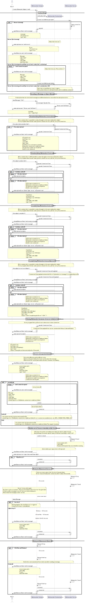

# TestWebSocekts

This projects uses RxJs WebSocket Client and C# WebSocketSharp to test different client responses to network and server events like network down, server down, etc.

The main intent is to provide a Client side websocket capable of statying open permanently by retrying the connection when there are errors in the server, errors in the client, etc.

## Server

The server side is consists of a simple WebSocketSharp server with 4 differnt paths.  This was used to test how different paths can deliver messages to different clients that subscribe to them
* Home
* Office
* Kitchen
* Heartbeat
From the server there are options to:
* Start the Server
* Stop the server
* Broadcast a message to all clients in home
* Broadcast a message to all clients in office
* Broadcast a message to all clients in kitchen

## Client
There are two branches on the client project:
* ButtonDriven: This is use to test each step needed to set up an RxJs server, to send different types of messages, and to try different ways to close the client
* Client: This is the final result that shows a way to set up a WebSocket client capable of connecting to different websocket paths, and that survives after various events such as: 
    * Client Network drops
    * Client going to sleep, or client loosing focus
    * Server Disconnects
    * Server network drops.

## Observations.
Recovering a connection after a network drop is handled differently in different operating systems, and device types.  The RxJs Pipe.Retry observer is not sufficient to maintain a client connected permanently.  A heartbeat mechanism is needed in the client to check and recover from network error. RxJs provides several other functions to implement timeouts for lack of responses.  These are still too slow in certain circumstances, so a JavaScript network connect EventListener is used to detect local drops.

## UML
The follwing UML diagram symbolizes the different tests made using the ButtonDriven Code.
